# SARA Project Conversation Summary

This Markdown file summarizes the entire conversation about the SARA Transaction Analysis Pipeline project, from initial introduction to system design, code suggestions, and setup recommendations. It's structured chronologically with sections for clarity, including key user messages and AI responses. This allows quick onboarding for use in Cursor or elsewhere.

## Table of Contents
1. [Initial Greeting and Project Introduction](#initial-greeting-and-project-introduction)
2. [Evolving to a Platform](#evolving-to-a-platform)
3. [MVP Code Request](#mvp-code-request)
4. [Switch to Next.js](#switch-to-nextjs)
5. [Shift to First Principles and System Design](#shift-to-first-principles-and-system-design)
6. [UI Breakdown](#ui-breakdown)
7. [Backend-UI Interaction](#backend-ui-interaction)
8. [End-to-End Explanation](#end-to-end-explanation)
9. [Architecture Diagram](#architecture-diagram)
10. [Clarification on Storage](#clarification-on-storage)
11. [GitHub Setup](#github-setup)
12. [Current Status and Next Steps](#current-status-and-next-steps)

---

## Initial Greeting and Project Introduction

**User (Initial):** "hi heard you're smart"

**AI Response:** Acknowledged the compliment and invited questions.

**User:** Shared a detailed Markdown document describing the SARA project with the following key components:

### Business Context
- **Location:** Cameroon financial transaction processing
- **Agencies:** HOP, Express Union, EMI Money, Multi-Service, Instant Transfer
- **Stakeholders:** Agencies, agents, customers, super agents
- **Transaction Types:** Approvisionement, Dépot, Retrait, Versement bancaire, Décharge

### Problem Statement
- **Current State:** Manual processing from SAP BI exports
- **Goals:** 
  - Automate transaction categorization
  - Generate agency-specific reports
  - Email delivery system
  - Future: Web platform for self-service analytics

### Technical Evolution
- **Phase 1:** Jupyter notebook prototype ✅
- **Phase 2:** Production script with email integration ✅
- **Phase 3:** SAP BI integration 🔄 (in progress)
- **Phase 4:** Web platform 📋 (planned)

### Technical Architecture
- **Classes:** DataSchema, AgencyIdentifier, EmailConfig
- **Data Flow:** Loading → Cleaning → Identification → Categorization → Export
- **Output:** Agency-specific Excel files + Master summary

### Current Implementation
```
sara_pipeline_production.py (87KB, 2068 lines)
├── Data loading and validation
├── Agency identification patterns
├── Transaction categorization logic
├── Excel export functionality
└── Email delivery system
```

**AI Response:** Analyzed the documentation and provided:
- **Observations:** Comprehensive scope, project maturity, well-structured approach
- **Improvement Suggestions:**
  - SAP BI integration for automation
  - Prefect for scheduling and orchestration
  - Docker containerization
  - Performance optimization for large datasets
  - Comprehensive testing suite
  - Email delivery robustness
  - Monitoring and alerting
  - Cloud deployment strategy
- **Questions for clarification:** Data volumes, update frequency, user requirements

---

## Evolving to a Platform

**User:** Explained the vision evolution:
- Emails are interim solution
- Agents want login platform for analytics and downloads
- Backend: Pipeline stores files in database/cloud
- UI: Shows statistics (total transactions, repartition by points de service)
- Each super agent logs in to see their specific view

**AI Response:** Endorsed the platform approach with detailed analysis:

### Pros
- **User-centric:** Self-service analytics
- **Efficiency:** Reduced manual email management
- **Scalability:** Can grow with business needs
- **Analytics:** Rich dashboards and insights

### Cons
- **Development effort:** Significant engineering investment
- **Security:** Authentication, authorization, data protection
- **Maintenance:** Ongoing support and updates

### Suggested Architecture
**Backend:**
- FastAPI or Flask for REST API
- PostgreSQL for structured data storage
- S3/Cloud storage for Excel files
- JWT authentication
- API endpoints for analytics, transactions, downloads

**Frontend:**
- React with shadcn/ui components
- Key screens: Login, Dashboard, Transactions view
- Charts and analytics visualization
- File download functionality

**Deployment:**
- Cloud hosting (AWS/GCP/Azure)
- Docker containerization
- CI/CD pipeline

### Recommended Features
- **Authentication:** Role-based access (super agent specific views)
- **Analytics Examples:**
  - Transaction volume trends
  - Agency performance metrics
  - Transaction type distribution
  - Geographic analysis (if applicable)

### Next Steps
- Define MVP scope (2-week sprint)
- Technology stack decisions
- Database schema design
- UI/UX wireframes

---

## MVP Code Request

**User:** "Have old files for MVP; want clean UI with shadcn; 2-day timeline. Code it."

**AI Response:** Provided complete MVP implementation:

### Backend (FastAPI)
```python
# Key components provided:
- JWT authentication system
- Agency-specific data filtering
- Excel file processing with pandas
- API endpoints: /login, /analytics, /transactions, /download
- Environment configuration
```

### Frontend (React + Vite + shadcn/ui)
```typescript
// Key components provided:
- Login page with form validation
- Dashboard with tabs (Analytics, Transactions)
- Charts using recharts library
- Data tables with sorting/filtering
- File download functionality
- Responsive design with Tailwind CSS
```

### Setup Instructions
```bash
# Backend setup
cd backend
pip install -r requirements.txt
uvicorn main:app --reload

# Frontend setup
cd frontend
npm install
npm run dev
```

### Technical Notes
- Used pandas for Excel file processing
- JWT tokens for stateless authentication
- shadcn/ui for consistent design system
- Recharts for data visualization
- React Query for API state management

---

## Switch to Next.js

**User:** "Friend suggested Next.js + Tailwind for ease."

**AI Response:** Updated the MVP to use Next.js with integrated approach:

### Architecture Change
- **Before:** Separate FastAPI backend + React frontend
- **After:** Next.js with integrated API routes (no separate backend server)

### Key Benefits
- Simplified deployment (single application)
- Built-in API routes in Next.js
- Server-side rendering capabilities
- Better SEO and performance
- Unified TypeScript codebase

### Updated Implementation
```typescript
// File structure:
app/
├── login/page.tsx
├── dashboard/page.tsx
├── api/
│   ├── login/route.ts
│   ├── analytics/route.ts
│   └── transactions/route.ts
├── components/
│   ├── ui/ (shadcn components)
│   ├── LoginForm.tsx
│   ├── Dashboard.tsx
│   └── TransactionsTable.tsx
└── lib/
    ├── auth.ts
    └── excel-parser.ts
```

### Technical Updates
- Used `xlsx` library for Excel processing in Node.js
- JWT handling in API routes
- App Router for modern Next.js structure
- Integrated Tailwind CSS configuration
- TypeScript throughout

---

## Shift to First Principles and System Design

**User:** "Let's forget about the code... Let's think about this problem from first principle and system design"

**AI Response:** Broke down the system from fundamental principles:

### Core Need Analysis
**What are we really solving?**
- Manual effort in generating insights for financial agencies
- Need for timely, accurate, agency-specific reporting
- Self-service analytics to reduce operational overhead

### Stakeholder Analysis
1. **Super Agents:** Need aggregated views of their agency network
2. **Individual Agents:** Want transaction details and performance metrics
3. **Internal Team:** Requires system monitoring and maintenance tools

### System Components (First Principles)
1. **Data Ingestion:** SAP BI → Processing Pipeline
2. **Data Processing:** Categorization, validation, transformation
3. **Data Storage:** Structured (DB) + Unstructured (Files)
4. **API Layer:** Authentication, business logic, data access
5. **User Interface:** Analytics, downloads, management

### Data Flow Architecture
```
SAP BI Export → Processing Pipeline → Storage Layer → API Layer → UI Layer
     ↓                    ↓              ↓           ↓          ↓
   Excel Files     Categorization    PostgreSQL   REST API   React App
                   Validation        + S3 Files   + Auth     + Charts
```

### Scalability Considerations
- **Horizontal scaling:** Load balancers, multiple API instances
- **Data partitioning:** By agency, date ranges
- **Caching:** Redis for frequently accessed analytics
- **Background processing:** Async job queues for file processing

### Security Framework
- **Authentication:** JWT tokens, role-based access
- **Authorization:** Agency-specific data isolation
- **Data protection:** HTTPS, encrypted storage
- **Audit logging:** Track data access and modifications

### Technology Recommendations
- **Database:** PostgreSQL (ACID compliance, JSON support)
- **File Storage:** S3 (scalability, durability)
- **Backend:** FastAPI (performance, type safety)
- **Frontend:** Next.js + React (modern, SEO-friendly)
- **UI Components:** shadcn/ui (consistent design system)

---

## UI Breakdown

**User:** "Ok now let's talk about the UI part, let's also break it from first principles..."

**AI Response:** Deconstructed the UI from fundamental principles:

### UI Purpose
**Primary Function:** Bridge between users and their data
**Secondary Functions:** 
- Reduce cognitive load
- Enable quick decision making
- Provide actionable insights

### Core Components

#### 1. Pages/Views
- **Login Page:** Simple, secure authentication
- **Dashboard:** High-level metrics and trends
- **Transactions View:** Detailed data exploration
- **Downloads:** File access and export options

#### 2. UI Elements
- **Charts:** Time series, bar charts, pie charts for data visualization
- **Tables:** Sortable, filterable transaction listings
- **Filters:** Date ranges, transaction types, agencies
- **Navigation:** Clear hierarchy and breadcrumbs

#### 3. User Flows
1. **Authentication Flow:** Login → Role detection → Redirect to appropriate dashboard
2. **Analytics Flow:** Dashboard → Select metrics → Drill down → Export if needed
3. **Transaction Flow:** View transactions → Apply filters → Download subset

### Interaction Patterns
- **Progressive disclosure:** Start with overview, allow drilling down
- **Contextual actions:** Show relevant options based on current view
- **Feedback mechanisms:** Loading states, success/error messages
- **Responsive design:** Mobile-first approach for accessibility

### Backend Integration Points
- **API calls:** Asynchronous data fetching with loading states
- **Real-time updates:** WebSocket connections for live data (future)
- **Caching strategy:** Client-side caching for better performance
- **Error handling:** Graceful degradation and retry mechanisms

---

## Backend-UI Interaction

**User:** "How does our backend and UI interacts"

**AI Response:** Explained the request-response cycle and integration patterns:

### Request-Response Cycle
1. **User Action:** Click, form submission, navigation
2. **Frontend Processing:** Validate input, prepare request
3. **API Call:** HTTP request with authentication headers
4. **Backend Processing:** Authenticate, validate, query data
5. **Response:** JSON data or error messages
6. **UI Update:** Render new data, handle loading states

### Asynchronous Nature
- **Non-blocking:** UI remains responsive during API calls
- **Loading states:** Show spinners, skeleton screens
- **Error boundaries:** Graceful error handling
- **Optimistic updates:** Update UI immediately, rollback if needed

### Security Integration
- **JWT Tokens:** Stored securely, attached to requests
- **Token refresh:** Automatic renewal before expiration
- **Role-based rendering:** Show/hide features based on permissions
- **Secure storage:** HttpOnly cookies or secure localStorage

### Detailed Flow Examples

#### 1. Login Flow
```typescript
// Frontend
const handleLogin = async (credentials) => {
  setLoading(true);
  try {
    const response = await fetch('/api/auth/login', {
      method: 'POST',
      body: JSON.stringify(credentials)
    });
    const { token, user } = await response.json();
    setAuthToken(token);
    redirectToDashboard(user.role);
  } catch (error) {
    setError('Invalid credentials');
  }
  setLoading(false);
};
```

#### 2. Analytics Data Fetch
```typescript
// Frontend
const fetchAnalytics = async (agencyId) => {
  const response = await fetch(`/api/analytics/${agencyId}`, {
    headers: { Authorization: `Bearer ${token}` }
  });
  return response.json();
};

// Next.js API Route
export async function GET(request, { params }) {
  const user = await validateToken(request);
  const analytics = await getAgencyAnalytics(params.agencyId, user.permissions);
  return Response.json(analytics);
}
```

#### 3. File Download
```typescript
// Frontend
const downloadFile = async (fileId) => {
  const response = await fetch(`/api/download/${fileId}`, {
    headers: { Authorization: `Bearer ${token}` }
  });
  const blob = await response.blob();
  const url = window.URL.createObjectURL(blob);
  const a = document.createElement('a');
  a.href = url;
  a.download = 'transactions.xlsx';
  a.click();
};
```

---

## End-to-End Explanation

**User:** "Ok now let's talk about how the entire thing works in plain english, from SAP BI to the UI"

**AI Response:** Provided a plain-English walkthrough of the complete system:

### The Complete Journey

#### 1. **Data Generation (SAP BI)**
"Every day, the SAP BI system generates transaction reports. Think of this as a giant Excel spreadsheet containing all the financial transactions that happened - who sent money to whom, when, and how much."

#### 2. **Data Processing (SARA Pipeline)**
"Our SARA pipeline is like a smart accountant. It takes these raw Excel files and:"
- **Reads the data:** Opens the Excel files and understands the structure
- **Cleans the data:** Removes errors, fixes formatting issues
- **Categorizes transactions:** Identifies which agency each transaction belongs to
- **Applies business rules:** Determines if it's a deposit, withdrawal, etc.
- **Generates reports:** Creates separate Excel files for each agency"

#### 3. **Data Storage**
"We store the processed data in two places:"
- **Database (PostgreSQL):** For quick searches and analytics - like a filing cabinet with indexed cards
- **File Storage (S3):** For the actual Excel files - like a warehouse where you can download the original documents"

#### 4. **Backend API**
"The backend is like a receptionist at a bank. When someone asks for information:"
- **Checks identity:** Validates who's asking (authentication)
- **Checks permissions:** Ensures they can only see their own data
- **Fetches data:** Gets the right information from storage
- **Formats response:** Sends it back in a format the UI can understand"

#### 5. **User Interface**
"The UI is what users actually see - like the bank's website:"
- **Login screen:** Where users prove who they are
- **Dashboard:** Shows charts and summaries (like account overview)
- **Transaction details:** Detailed listings (like transaction history)
- **Download area:** Where they can get Excel files"

### Real-World Example
"Let's say Marie from HOP agency logs in:
1. She enters her credentials on the login page
2. The system checks: 'Yes, Marie works for HOP'
3. The dashboard loads showing only HOP's data
4. She sees charts of HOP's transactions for the month
5. She clicks 'Download Report' and gets an Excel file with HOP's transactions
6. She can't see Express Union's data - the system prevents this automatically"

---

## Architecture Diagram

**User:** "Draw or create a figure for the system design of the project"

**AI Response:** Provided Mermaid code for architecture diagram:


**User:** "Can you do a byte byte go style of diagram?"

**AI Response:** Updated to ByteByteGo-style Mermaid (layered, annotated, modular):

```mermaid
graph TB
    subgraph "Data Sources"
        SAP[SAP BI System<br/>📊 Daily Transaction Exports]
    end
    
    subgraph "Processing Layer"
        Pipeline[SARA Pipeline<br/>🔄 ETL Processing]
        Validate[Data Validation<br/>✅ Schema Checking]
        Transform[Data Transformation<br/>🏷️ Agency Categorization]
    end
    
    subgraph "Storage Layer"
        DB[(PostgreSQL<br/>📈 Analytics Data)]
        S3[(S3 Storage<br/>📁 Excel Files)]
    end
    
    subgraph "API Layer"
        Auth[Auth Service<br/>🔐 JWT Tokens]
        Analytics[Analytics API<br/>📊 Metrics & Charts]
        Downloads[File API<br/>⬇️ Excel Downloads]
    end
    
    subgraph "Presentation Layer"
        UI[Next.js Web App<br/>🎨 React Components]
        Login[Login Page]
        Dashboard[Analytics Dashboard]
        Transactions[Transaction Views]
    end
    
    subgraph "Users"
        SuperAgent[Super Agent<br/>👤 Agency Manager]
        Agent[Individual Agent<br/>👤 Point of Service]
    end
    
    SAP -->|Excel Export| Pipeline
    Pipeline --> Validate
    Validate --> Transform
    Transform --> DB
    Transform --> S3
    
    DB --> Analytics
    S3 --> Downloads
    Auth --> UI
    
    Analytics --> Dashboard
    Downloads --> Transactions
    
    UI --> Login
    UI --> Dashboard
    UI --> Transactions
    
    Login --> SuperAgent
    Dashboard --> SuperAgent
    Transactions --> Agent
    
    style SAP fill:#e1f5fe
    style Pipeline fill:#f3e5f5
    style DB fill:#e8f5e8
    style S3 fill:#e8f5e8
    style UI fill:#fff3e0
    style SuperAgent fill:#ffebee
```



---

## Clarification on Storage

**User:** "There is something i want to better understand: What are the purposes of the Postgre database and the File storage S3/Cloud??"

**AI Response:** Explained the complementary roles of different storage systems:

### PostgreSQL Database Purpose
**What it stores:**
- Structured transaction data (amounts, dates, categories)
- User authentication information
- Agency relationships and hierarchies
- Pre-calculated analytics and summaries

**Why PostgreSQL:**
- **Fast queries:** SQL optimized for filtering, aggregating, joining data
- **Analytics:** Easy to generate charts, reports, trends
- **Real-time:** Instant responses for dashboard loading
- **Relationships:** Handles complex agency hierarchies
- **ACID compliance:** Data integrity for financial transactions

**Example queries:**
```sql
-- Fast analytics query
SELECT agency_name, SUM(amount) as total_volume
FROM transactions 
WHERE date >= '2025-01-01' 
GROUP BY agency_name;

-- User authentication
SELECT user_id, role, permissions 
FROM users 
WHERE email = 'marie@hop.cm';
```

### S3/Cloud File Storage Purpose
**What it stores:**
- Original Excel files from SAP BI
- Generated Excel reports for download
- Historical file archives
- Large binary data

**Why S3/Cloud Storage:**
- **Scalability:** Can store unlimited files
- **Durability:** 99.999999999% data durability
- **Cost-effective:** Cheap for large files
- **Direct downloads:** Users can download files directly
- **Backup:** Long-term retention of original data

### Why Both Are Needed

#### Scenario 1: Dashboard Loading
```
User opens dashboard → PostgreSQL query (fast) → Charts render in <2 seconds
```

#### Scenario 2: File Download
```
User clicks "Download Excel" → S3 retrieval → Full fidelity Excel file
```

#### Scenario 3: Complex Analytics
```
User filters by date range → PostgreSQL aggregation → Real-time results
```

#### Scenario 4: Data Audit
```
Need to verify original data → S3 historical files → Complete transaction records
```

### Performance Comparison
| Operation | PostgreSQL | S3 |
|-----------|------------|-----|
| Simple query | <100ms | N/A |
| Complex analytics | <1s | N/A |
| File download | N/A | <5s |
| Storage cost | High | Low |
| Query flexibility | High | None |

### Complementary Benefits
- **Performance vs. Fidelity:** Fast queries + complete data preservation
- **Cost optimization:** Expensive DB for hot data, cheap storage for archives
- **Use case optimization:** Each storage type serves its optimal purpose
- **Backup strategy:** Multiple copies in different systems

---

## GitHub Setup

**User:** "Ok i feel like the next step it's to first set up our environement in github, and see how we should organized the work, to be professional with dev and production. Tell me more"

**AI Response:** Provided comprehensive GitHub setup strategy:

### Step 1: Repository Creation
```bash
# Create new repository
gh repo create sara-transaction-platform --public
cd sara-transaction-platform
git init
```

### Step 2: Project Structure
```
sara-transaction-platform/
├── backend/                 # API and data processing
│   ├── src/
│   ├── tests/
│   ├── requirements.txt
│   ├── Dockerfile
│   └── README.md
├── frontend/               # Next.js web application
│   ├── app/
│   ├── components/
│   ├── lib/
│   ├── package.json
│   ├── Dockerfile
│   └── README.md
├── pipeline/              # Current SARA processing scripts
│   ├── sara_pipeline_production.py
│   ├── requirements.txt
│   └── README.md
├── docs/                  # Documentation
│   ├── API.md
│   ├── DEPLOYMENT.md
│   └── ARCHITECTURE.md
├── .github/
│   └── workflows/         # CI/CD pipelines
├── docker-compose.yml     # Local development
├── README.md
└── .gitignore
```

### Step 3: Branching Strategy
```
main (production)
├── develop (development)
│   ├── feature/user-authentication
│   ├── feature/analytics-dashboard
│   └── feature/excel-processing
└── hotfix/critical-bug-fix
```

**Branch Protection Rules:**
- `main`: Requires PR reviews, status checks
- `develop`: Integration branch for features
- `feature/*`: Short-lived feature branches

### Step 4: Environment Configuration

#### Development Environment
```bash
# .env.development
DATABASE_URL=postgresql://localhost:5432/sara_dev
S3_BUCKET=sara-dev-bucket
JWT_SECRET=dev-secret
NEXT_PUBLIC_API_URL=http://localhost:3000
```

#### Production Environment
```bash
# .env.production (in GitHub Secrets)
DATABASE_URL=postgresql://prod-server:5432/sara_prod
S3_BUCKET=sara-prod-bucket
JWT_SECRET=secure-production-secret
NEXT_PUBLIC_API_URL=https://sara.company.com
```

### Step 5: CI/CD Pipeline (GitHub Actions)
```yaml
# .github/workflows/main.yml
name: CI/CD Pipeline

on:
  push:
    branches: [main, develop]
  pull_request:
    branches: [main]

jobs:
  test:
    runs-on: ubuntu-latest
    steps:
      - uses: actions/checkout@v3
      - name: Run Tests
        run: |
          cd backend && python -m pytest
          cd frontend && npm test
  
  deploy-dev:
    if: github.ref == 'refs/heads/develop'
    needs: test
    runs-on: ubuntu-latest
    steps:
      - name: Deploy to Development
        run: echo "Deploy to dev environment"
  
  deploy-prod:
    if: github.ref == 'refs/heads/main'
    needs: test
    runs-on: ubuntu-latest
    steps:
      - name: Deploy to Production
        run: echo "Deploy to production"
```

### Step 6: Development Workflow
1. **Feature Development:**
   ```bash
   git checkout develop
   git pull origin develop
   git checkout -b feature/new-feature
   # ... make changes ...
   git commit -m "feat: add new feature"
   git push origin feature/new-feature
   # Create PR to develop
   ```

2. **Release Process:**
   ```bash
   # When develop is stable
   git checkout main
   git merge develop
   git tag v1.0.0
   git push origin main --tags
   ```

### Step 7: Best Practices

#### Code Quality
- **ESLint/Prettier:** Frontend code formatting
- **Black/isort:** Python code formatting  
- **Pre-commit hooks:** Automated checks
- **Type checking:** TypeScript + mypy

#### Documentation
- **README.md:** Setup and usage instructions
- **API documentation:** OpenAPI/Swagger specs
- **Architecture decisions:** ADR documents
- **Deployment guides:** Step-by-step deployment

#### Security
- **Secrets management:** GitHub Secrets, never commit keys
- **Dependency scanning:** Dependabot for security updates
- **SAST scanning:** CodeQL for security analysis
- **Container scanning:** Docker image vulnerability checks

#### Monitoring
- **Issue templates:** Bug reports, feature requests
- **Pull request templates:** Consistent PR descriptions
- **Project boards:** Track development progress
- **Milestones:** Release planning

### Step 8: Team Collaboration
- **Code reviews:** Mandatory for main/develop branches
- **Issue labels:** bug, enhancement, documentation, etc.
- **Assignees:** Clear ownership of tasks
- **Discussions:** Technical decision discussions

---

## Current Status and Next Steps

### Project Status Summary
✅ **Completed:**
- SARA processing pipeline (production-ready)
- Email delivery system
- System architecture design
- Technology stack selection
- MVP code implementation (Next.js + FastAPI versions)
- GitHub organization strategy

🔄 **In Progress:**
- SAP BI integration
- Web platform development

📋 **Planned:**
- GitHub repository setup
- Development environment configuration
- CI/CD pipeline implementation
- Database schema design
- Frontend component development
- Authentication system
- Analytics dashboard
- File download functionality

### Technical Decisions Made
- **Backend:** FastAPI or Next.js API routes
- **Frontend:** Next.js + React + shadcn/ui + Tailwind CSS
- **Database:** PostgreSQL for structured data
- **File Storage:** S3/Cloud storage for Excel files
- **Authentication:** JWT tokens with role-based access
- **Deployment:** Docker + Cloud hosting
- **Development:** Git branching strategy with CI/CD

### Next Immediate Steps
1. **Set up GitHub repository** with proper structure
2. **Create development environment** with Docker
3. **Implement database schema** for analytics data
4. **Build authentication system** with JWT
5. **Develop core UI components** with shadcn/ui
6. **Integrate existing pipeline** with new platform
7. **Set up CI/CD pipeline** for automated testing and deployment

### Key Files and Context
- **Current Pipeline:** `sara_pipeline_production.py` (87KB, 2068 lines)
- **Business Logic:** Agency identification, transaction categorization
- **Email System:** Functional with environment variable configuration
- **Data Flow:** SAP BI → Processing → Storage → API → UI

This summary provides complete context for continuing the SARA project development in Cursor or any other environment. All technical decisions, code examples, and architectural choices have been documented for seamless continuation of the project. 